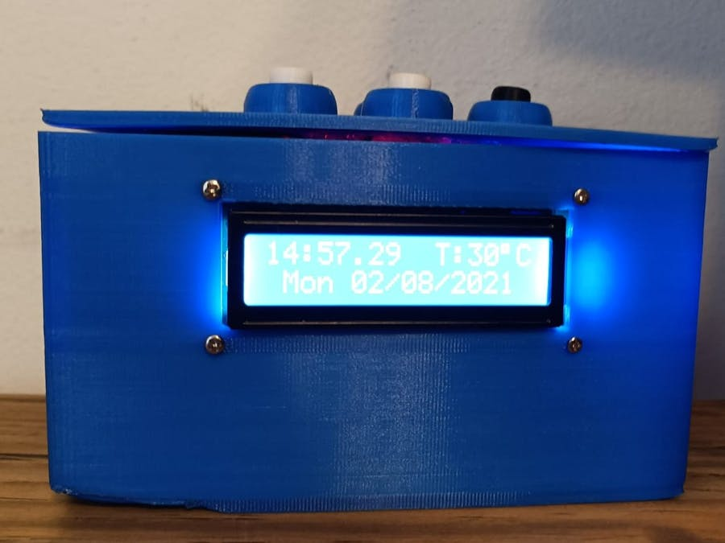
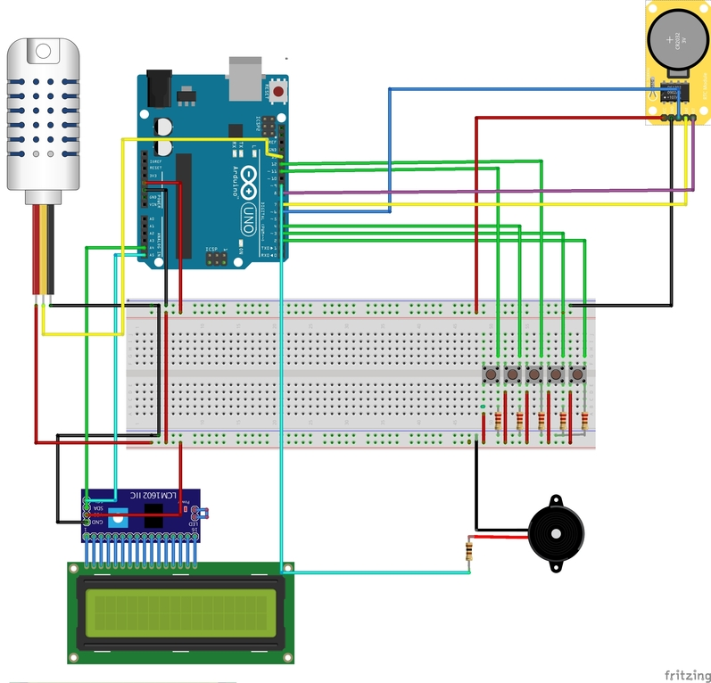

<h1>All In One Clock</h1>

In this project we will make an arduino clock alarm with timer and a temperature sensor.
  
   
 <h1>Components</h1>
 <ul>
 <li><a href="https://store.arduino.cc/products/arduino-uno-rev3/">Arduino UNO</a></li>
 <li><a href="https://store.arduino.cc/products/proto-shield-rev3-uno-size">Arduino Proto Shield</a></li>
 <li><a href="https://www.newark.com/maxim-integrated-products/ds1307/real-time-clock-56byte-dip-8/dp/73Y1206?COM=ref_hackster">Real Time Clock</a></li>
 <li><a href="https://www.dfrobot.com/product-135.html">16x2 Display</a></li>
 <li><a href="https://www.newark.com/apem/mjtp1230/switch-tactile-spst-50ma-through/dp/19C7994?COM=ref_hackster&CMP=Hackster-NA-project-98bf36-Feb-22">Tactile Switch</a></li>
 <li><a href="https://www.aliexpress.com/item/4000785325910.html?spm=a2g0o.productlist.0.0.61923f7cS5MI2w&algo_pvid=d52a4127-5191-45e6-bb08-5a729bccddbb&algo_exp_id=d52a4127-5191-45e6-bb08-5a729bccddbb-4&pdp_ext_f=%7B%22sku_id%22%3A%2210000007816863808%22%7D&pdp_pi=-1%3B0.69%3B-1%3B-1%40salePrice%3BUSD%3Bsearch-mainSearch">Buzzer</a></li>
 <li><a href="https://www.newark.com/multicomp/mcbb400/breadboard-solderless-abs/dp/99W1759?COM=ref_hackster">Breadboard</a></li>
 <li><a href="https://www.newark.com/stellar-labs/24-14687/kit-contents-eight-25-ft-spools/dp/44AC9034?COM=ref_hackster">Wires</a></li>
 <li><a href="https://www.aliexpress.com/item/32982744232.html?spm=a2g0o.productlist.0.0.21a165ddT3AtVp&algo_pvid=26acb624-433b-4616-9452-97fdb7d23fa4&algo_exp_id=26acb624-433b-4616-9452-97fdb7d23fa4-6">AM2302 DHT22</a></li>
 </ul>
 <h1>Wiring</h1>
 

  
  <b>Button #1 Mode</b> - connected to digtal pin 2

  <b>Button #2 Select</b> - connected to digtal pin 4

  <b>Button #3 Plus</b> - connected to digtal pin 3

  <b>Button #4 Minus</b> - connected to digtal pin 12

  <b>Button #5 Timer on/0ff</b> - connected to digtal pin 11

You can wire all of the component to a breadboard or wire to a arduino proto shield if you would like to use the case.

<h1>Upload The Code</h1>

Open your <a href="https://www.arduino.cc/en/software">arduino ide</a> and upload clock_alarm.ino
 
 make sure to downlod these libraries first

<h1>libraries:</h1>

<b>DHT</b> - https://github.com/adafruit/DHT-sensor-library

<b>LiquidCrystal I2C</b> - https://www.arduinolibraries.info/libraries/liquid-crystal-i2-c

<b>Wire</b> - https://github.com/arduino/ArduinoCore-avr/tree/master/libraries/Wire

<b>virtuabotixRTC</b> - https://github.com/chrisfryer78/ArduinoRTClibrary

<b>RTCLib</b> - https://github.com/adafruit/RTClib
 
<h1>Usage</h1>

 <ul>
  <li>Change between screens by pressing mode button</li>
  <li>Set time by holding mode button in screen 1</li>
  <li>Screen 1 - time date and temprature</li>
  <li>Screen 2 - set up the alarm</li>
  <li>Screen 3 - timer</li>
  <li>Screen 4 - alarm On/off</li>
</ul>  
<h1>More Info</h1>

You can find all of the 3d print file in the model folder

Contact me or more info at Arduino Project Hub:https://create.arduino.cc/projecthub/dzh121/all-in-one-clock-6ca214

